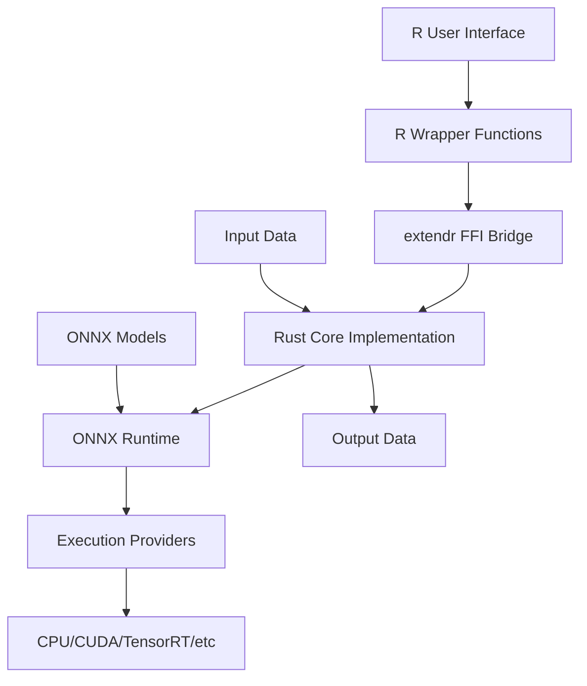

# Design Document

## Overview

churon R 패키지의 ONNX Runtime 통합을 완전히 동작하도록 재설계합니다. 현재 구현에서는 모델 로드는 가능하지만 실제 추론 실행, 적절한 에러 처리, 그리고 R 데이터 구조와의 변환이 누락되어 있습니다. 이 설계는 Rust의 ort 크레이트와 extendr를 통해 안정적이고 사용하기 쉬운 ONNX 모델 실행 환경을 제공합니다.

## Architecture

### High-Level Architecture



### Component Layers

1. **R Interface Layer**: R 함수들과 S3 클래스 시스템
2. **FFI Bridge Layer**: extendr를 통한 R-Rust 상호작용
3. **Rust Core Layer**: 핵심 ONNX Runtime 로직
4. **ONNX Runtime Layer**: 모델 실행과 최적화
5. **Hardware Layer**: 다양한 실행 제공자들

## Components and Interfaces

### 1. RSession 구조체 (Rust)

현재 구현을 확장하여 완전한 기능을 제공:

```rust
pub struct RSession {
    session: Session,
    input_names: Vec<String>,
    output_names: Vec<String>,
    input_shapes: Vec<Vec<i64>>,
    output_shapes: Vec<Vec<i64>>,
}
```

**주요 메서드:**
- `from_path(path: &str, providers: Option<Vec<String>>) -> Result<Self>`
- `get_input_info() -> Vec<TensorInfo>`
- `get_output_info() -> Vec<TensorInfo>`
- `run(inputs: HashMap<String, Array>) -> Result<HashMap<String, Array>>`
- `get_providers() -> Vec<String>`

### 2. TensorInfo 구조체 (Rust)

모델의 입력/출력 정보를 담는 구조체:

```rust
#[derive(Debug, Clone)]
pub struct TensorInfo {
    name: String,
    shape: Vec<i64>,
    data_type: String,
}
```

### 3. R Interface Functions

R에서 사용할 주요 함수들:

- `onnx_session(model_path, providers = NULL)`: 세션 생성
- `onnx_run(session, inputs)`: 추론 실행
- `onnx_input_info(session)`: 입력 정보 조회
- `onnx_output_info(session)`: 출력 정보 조회
- `onnx_providers(session)`: 실행 제공자 정보
- `onnx_example_models()`: 예시 모델 경로들

### 4. 유틸리티 함수들

- `find_model_path(model_name)`: 패키지 내 모델 파일 찾기
- `validate_input_data(data, expected_info)`: 입력 데이터 검증
- `convert_r_to_ndarray(r_data)`: R 데이터를 ndarray로 변환
- `convert_ndarray_to_r(ndarray_data)`: ndarray를 R 데이터로 변환

## Data Models

### Input/Output Data Flow

1. **R → Rust 변환**:
   - R matrix/array → ndarray::Array
   - R list → HashMap<String, Array>
   - 데이터 타입 검증 및 변환

2. **Rust → ONNX Runtime**:
   - ndarray::Array → ort::Value
   - 메모리 레이아웃 최적화

3. **ONNX Runtime → Rust**:
   - ort::Value → ndarray::Array
   - 출력 텐서 수집

4. **Rust → R 변환**:
   - ndarray::Array → R matrix/array
   - HashMap<String, Array> → R named list

### 데이터 타입 매핑

| ONNX Type | Rust Type | R Type |
|-----------|-----------|---------|
| Float32 | f32 | numeric |
| Float64 | f64 | numeric |
| Int32 | i32 | integer |
| Int64 | i64 | integer |
| String | String | character |

## Error Handling

### Error Types

1. **ModelLoadError**: 모델 로드 실패
2. **InferenceError**: 추론 실행 실패
3. **DataConversionError**: 데이터 변환 실패
4. **ValidationError**: 입력 데이터 검증 실패
5. **ProviderError**: 실행 제공자 관련 오류

### Error Propagation

```rust
// Rust에서 상세한 에러 정보 제공
pub enum ChurOnError {
    ModelLoad(String),
    Inference(String),
    DataConversion(String),
    Validation(String),
    Provider(String),
}

impl From<ChurOnError> for extendr_api::Error {
    fn from(err: ChurOnError) -> Self {
        match err {
            ChurOnError::ModelLoad(msg) => 
                extendr_api::Error::EvalError(format!("Model load failed: {}", msg).into()),
            // ... 다른 에러 타입들
        }
    }
}
```

### R에서의 에러 처리

- `try()` 함수를 사용한 안전한 호출
- 명확한 에러 메시지 제공
- 디버깅을 위한 상세 정보 포함

## Testing Strategy

### Unit Tests (Rust)

1. **모델 로드 테스트**:
   - 유효한 모델 파일 로드
   - 잘못된 경로 처리
   - 손상된 모델 파일 처리

2. **데이터 변환 테스트**:
   - R 데이터 → ndarray 변환
   - ndarray → R 데이터 변환
   - 다양한 데이터 타입 지원

3. **추론 테스트**:
   - 간단한 모델로 추론 실행
   - 배치 처리
   - 다양한 입력 크기

### Integration Tests (R)

1. **패키지 로드 테스트**:
   - `library(churon)` 성공
   - 모든 함수 export 확인

2. **예시 모델 테스트**:
   - 패키지 내 모델 로드
   - 샘플 데이터로 추론
   - 결과 검증

3. **에러 처리 테스트**:
   - 잘못된 입력에 대한 적절한 에러
   - 에러 메시지 명확성

### Performance Tests

1. **메모리 사용량 모니터링**
2. **추론 속도 벤치마크**
3. **다양한 모델 크기에서의 성능**

## Implementation Considerations

### Memory Management

- Rust의 소유권 시스템을 활용한 안전한 메모리 관리
- R과 Rust 간 데이터 복사 최소화
- 대용량 모델 처리를 위한 메모리 최적화

### Cross-Platform Compatibility

- Windows, macOS, Linux 지원
- 다양한 실행 제공자의 조건부 컴파일
- 플랫폼별 빌드 설정 최적화

### Performance Optimization

- 모델 로드 시 그래프 최적화 활용
- 실행 제공자 우선순위 설정
- 배치 처리 지원으로 처리량 향상

### Documentation

- roxygen2를 사용한 R 함수 문서화
- 사용 예제와 튜토리얼 제공
- 에러 해결 가이드 포함